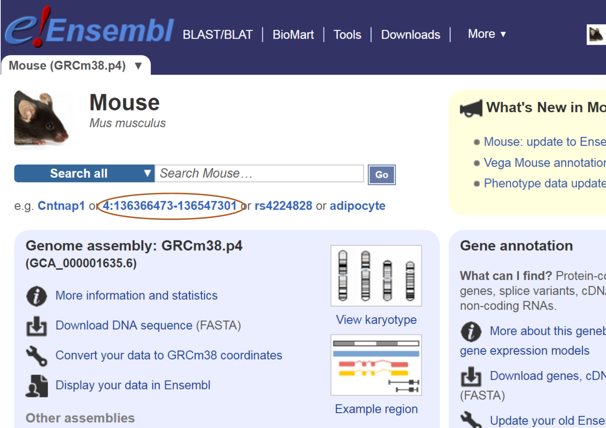
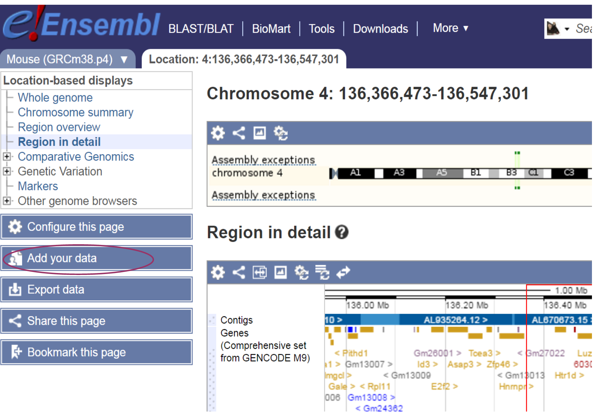
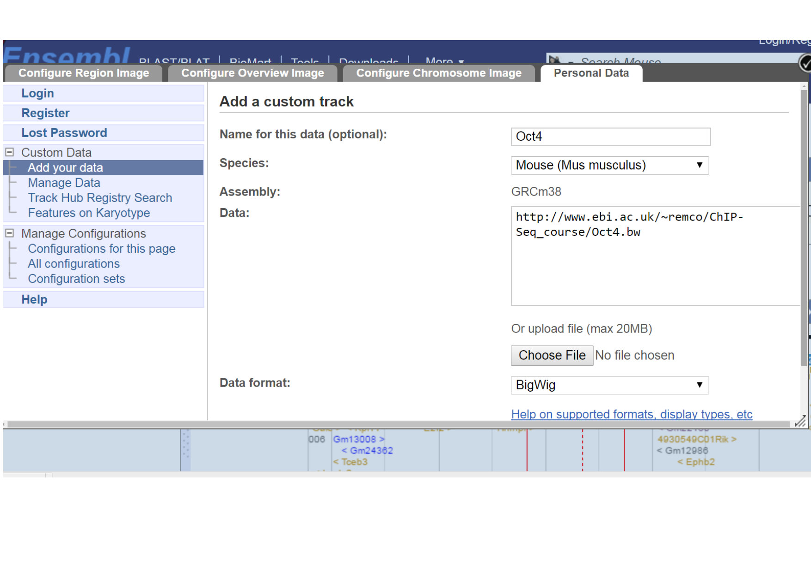
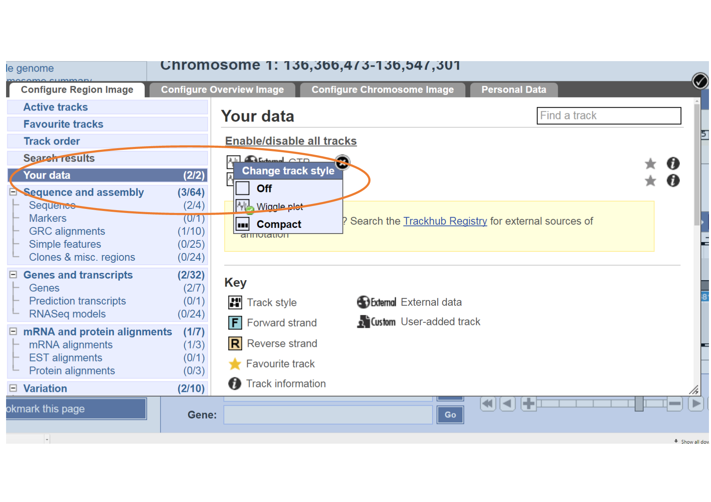

Key Learning Outcomes
---------------------

After completing this practical the trainee should be able to:

-   Perform simple ChIP-Seq analysis, e.g. the detection of
    immuno-enriched areas using the chosen peak caller program MACS

-   Visualize the peak regions through a genome browser, e.g. Ensembl,
    and identify the real peak regions

-   Perform functional annotation and detect potential binding sites
    (motif) in the predicted binding regions using motif discovery tool,
    e.g. MEME.

Resources You’ll be Using
-------------------------

### Tools Used

MACS
:   \
    <http://liulab.dfci.harvard.edu/MACS/index.html>

Ensembl
:   \
    <http://www.ensembl.org>

PeakAnalyzer
:   \
    <http://www.ebi.ac.uk/bertone/software>

MEME
:   \
    <http://meme.ebi.edu.au/meme/tools/meme>

TOMTOM
:   \
    <http://meme.ebi.edu.au/meme/tools/tomtom>

DAVID
:   \
    <http://david.abcc.ncifcrf.gov>

GOstat
:   \
    <http://gostat.wehi.edu.au>

### Sources of Data

<http://www.ebi.ac.uk/arrayexpress/experiments/E-GEOD-11431>

Introduction
------------

The goal of this hands-on session is to perform some basic tasks in the
analysis of ChIP-seq data. In fact, you already performed the first
step, alignment of the reads to the genome, in the previous session. We
start from the aligned reads and we will find immuno-enriched areas
using the peak caller MACS. We will visualize the identified regions in
a genome browser and perform functional annotation and motif analysis on
the predicted binding regions.

Prepare the Environment
-----------------------

The material for this practical can be found in the `ChIP-seq` section
of your manual. Please make sure that this directory also contains the
SAM/BAM files you produced during the alignment practical.

If you didn’t have time to align the control file called `gfp.fastq`
during the alignment practical, please do it now. Follow the same steps,
from the bowtie2 alignment step, as for the `Oct4.fastq` file.

Open the Terminal and go to the `chipseq` directory:

    cd /home/trainee/chipseq

Finding enriched areas using MACS
---------------------------------

MACS stands for Model based analysis of ChIP-seq. It was designed for
identifying transcription factor binding sites. MACS captures the
influence of genome complexity to evaluate the significance of enriched
ChIP regions, and improves the spatial resolution of binding sites
through combining the information of both sequencing tag position and
orientation. MACS can be easily used for ChIP-Seq data alone, or with a
control sample to increase specificity.

Consult the MACS help file to see the options and parameters:

    macs --help

The input for MACS can be in ELAND, BED, SAM, BAM or BOWTIE formats (you
just have to set the `–format` option).

Options that you will have to use include:

-t
:   To indicate the input ChIP file.

-c
:   To indicate the name of the control file.

–format
:   To change the file format. The default format is bed.

–name
:   To set the name of the output files.

–gsize
:   This is the mappable genome size. With the read length we have,
    $70\%$ of the genome is a fair estimation. Since in this analysis we
    include only reads from chromosome 1 (197Mbases), we will use a
    `–gsize` of 138Mbases (70% of 197Mbases).

–tsize
:   To set the read length (look at the FASTQ files to check the
    length).

–wig
:   To generate signal wig files for viewing in a genome browser. Since
    this process is time consuming, it is recommended to run MACS first
    with this flag off, and once you decide on the values of the
    parameters, run MACS again with this flag on.

–diag
:   To generate a saturation table, which gives an indication whether
    the sequenced reads give a reliable representation of the possible
    peaks.

Now run macs using the following command:

    macs -t <Oct4_aligned_bam_file> -c <gfp_aligned_bam_file> --format=BAM --name=Oct4 --gsize=138000000 --tsize=26 --diag --wig 

Look at the output saturation table (`Oct4_diag.xls`). To open this file
file, right-click on it and choose “Open with” and select LibreOffice.
Do you think that more sequencing is necessary?

Open the Excel peak file and view the peak details. Note that the number
of tags (column 6) refers to the number of reads in the whole peak
region and not the peak height.

Viewing results with the Ensembl genome browser
-----------------------------------------------

It is often instructive to look at your data in a genome browser.
Before, we used IGV, a stand-alone browser, which has the advantage of
being installed locally and providing fast access. Web-based genome
browsers, like Ensembl or the UCSC browser, are slower, but provide more
functionality. They do not only allow for more polished and flexible
visualisation, but also provide easy access to a wealth of annotations
and external data sources. This makes it straightforward to relate your
data with information about repeat regions, known genes, epigenetic
features or areas of cross-species conservation, to name just a few. As
such, they are useful tools for exploratory analysis.

They will allow you to get a ‘feel’ for the data, as well as detecting
abnormalities and problems. Also, exploring the data in such a way may
give you ideas for further analyses.

Launch a web browser and go to the Ensembl website at
<http://www.ensembl.org/index.html>

Choose the genome of interest (in this case, mouse) on the left side of
the page, browse to any location in the genome or click one of the demo
links provided on the web page.

[H]  [fig:MouseHome]

Click on the **Add your data** link on the left, then choose **Add your
data** in the **Custom Data** tab.

[H]  [fig:AddData]

Wig files are large so are inconvenient for uploading directly to the
Ensemble Genome browser. Instead, we will convert it to an indexed
binary format and put this into a web accessible place such as on a
HTTP, HTTPS, or FTP server. This makes all the browsing process much
faster. Detailed instructions for generating a bigWig from a wig type
file can be found at:

<http://genome.ucsc.edu/goldenPath/help/bigWig.html>.

We have generated bigWig files in advance for you to upload to the
Ensembl browser. They are at the following URL:
<http://www.ebi.ac.uk/~remco/ChIP-Seq_course/Oct4.bw> (Please right
click and choose “Copy Link Address” to copy the URL).

To visualise the data:

-   Paste the location above in the Data field.

-   Set data format bigWig.

-   Choose some informative name

-   Click Add data and in the next window choose the colour of your
    preference.

-   Click **Save** and close the window to return to the genome browser.

[H]  [fig:UploadURL]

Repeat the process for the gfp control sample, located at:

<http://www.ebi.ac.uk/~remco/ChIP-Seq_course/gfp.bw> (Please right click
and choose “Copy Link Address” to copy the URL).

After uploading, to make sure your data is visible:

-   Click in the left hand panel **Configure this page**

-   Select the first tab in the pop up **Configure Region Image**

-   Click **Your data** in the left panel

-   Choose each of the uploaded \*.bw files to confirm the **Wiggle
    plot** in **Change track style** pop up menu has been choosen.

-   Closing the window will save these changes.

[H]  [fig:ConfigureYourData]

Go to a region on chromosome 1 (e.g. `1:34823162-35323161`), and zoom in
and out to view the signal and peak regions. Be aware that the y-axis of
each track is auto-scaled independently of each other, so bigger-looking
peaks may not actually be bigger! Always look at the values on the left
hand side axis.

What can you say about the profile of Oct4 peaks in this region?

There are no significant Oct4 peaks over the selected region.

Compare it with H3K4me3 histone modification wig file we have generated
at <http://www.ebi.ac.uk/~remco/ChIP-Seq_course/H3K4me3.bw> .

H3K4me3 has a region that contains relatively high peaks than Oct4.

Jump to `1:36066594-36079728` for a sample peak. Do you think H3K4me3
peaks regions contain one or more modification sites? What about Oct4?

Yes. There are roughly three peaks, which indicate the possibility of
having more than one modification sites in this region.

For Oct4, no peak can be observed.

MACS generates its peak files in a file format called bed file. This is
a simple text format containing genomic locations, specified by
chromosome, begin and end positions, and some more optional information.

See <http://genome.ucsc.edu/FAQ/FAQformat.html#format1> for details.

Bed files can also be uploaded to the Ensembl browser.

Try uploading the peak file generated by MACS to Ensembl. Find the first
peak and the peak with the highest score (the fifth column) in the file
and see if the peak looks convincing to you.

Annotation: From peaks to biological interpretation
---------------------------------------------------

In order to biologically interpret the results of ChIP-seq experiments,
it is usually recommended to look at the genes and other annotated
elements that are located in proximity to the identified enriched
regions. This can be easily done using PeakAnalyzer.

Go to the PeakAnalyzer tool directory:

    cd /home/trainee/chipseq/peakanalyzer/1.4

Launch the PeakAnalyzer program by typing:

    java -jar PeakAnalyzer.jar &

Click okay in the pop up error message "Can’t reach ensembl.org". The
first window allows you to choose between the split application (which
we will try next) and peak annotation. Choose the peak annotation option
and click **Next**.

We would like to find the closest downstream genes to each peak, and the
genes that overlap with the peak region. For that purpose you should
choose the **NDG** option and click **Next**.

Fill in the location of the peak file `Oct4_peaks.bed`, and choose the
mouse GTF as the annotation file. You don’t have to define a symbol file
since gene symbols are included in the GTF file.

Choose the output directory and run the program.

When the program has finished running, you will have the option to
generate plots, by pressing the **Generate plots** button. This is only
possible if R is installed on your computer, as it is on this system. A
PDF file with the plots will be generated in the output folder. You
could generate similar plots with Excel using the output files that were
generated by PeakAnalyzer.

This list of closest downstream genes (contained in the file
`Oct4_peaks.ndg.bed`) can be the basis of further analysis. For
instance, you could look at the Gene Ontology terms associated with
these genes to get an idea of the biological processes that may be
affected. Web-based tools like DAVID (<http://david.abcc.ncifcrf.gov>)
or GOstat (<http://gostat.wehi.edu.au>) take a list of genes and return
the enriched GO categories.

We can pull out Ensemble Transcript IDs from the `Oct4_peaks.ndg.bed`
file and write them to another file ready for use with DAVID or GOstat:

    cut -f 5 Oct4_peaks.ndg.bed | sed '1 d' > Oct4_peaks.ndg.tid

Motif analysis
--------------

It is often interesting to find out whether we can associate the
identified binding sites with a sequence pattern or motif. We will use
MEME for motif analysis. The input for MEME should be a file in FASTA
format containing the sequences of interest. In our case, these are the
sequences of the identified peaks that probably contain Oct4 binding
sites.

Since many peak-finding tools merge overlapping areas of enrichment, the
resulting peaks tend to be much wider than the actual binding sites.
Sub-dividing the enriched areas by accurately partitioning enriched loci
into a finer-resolution set of individual binding sites, and fetching
sequences from the summit region where binding motifs are most likely to
appear enhances the quality of the motif analysis. Sub-peak summit
sequences can normally be retrieved directly from the Ensembl database
using PeakAnalyzer. Due to the connection error we have provided the
fasta sequences.

If you have closed the PeakAnalyzer running window, open it again. If it
is still open, just go back to the first window.

Choose the split peaks utility and click **Next**. The input consists of
files generated by most peak-finding tools: a file containing the
chromosome, start and end locations of the enriched regions, and a
`.wig` signal file describing the size and shape of each peak. Fill in
the location of both files `Oct4_peaks.bed` and the wig file generated
by MACS, which is under the `Oct4_MACS_wiggle/treat/` directory.
Normally we would check the option to **Fetch subpeak sequences** and
click **Next**. As we have no connection to ensembl We have provided the
subpeak sequences.

In the next window you have to set some parameters for splitting the
peaks.

Separation float
:   Keep the default value. This value determines when a peak will be
    separated into sub-peaks. This is the ratio between a valley and its
    neighbouring summit (the lower summit of the two). For example, if
    you set this height to be `0.5`, two sub-peaks will be separated
    only if the height of the lower summit is twice the height of the
    valley.

Minimum height
:   Set this to be `5`. Only sub-peaks with at least this number of tags
    in their summit region will be separated. Change the organism name
    from the default human to mouse and run the program.

Organism
:   Choose `Mus_musculus` from the drop down list.

Since the program has to read large wig files, it will take a few
minutes to run. Once the run is finished, two output files will be
produced. The first describes the location of the sub-peaks, and the
second is a FASTA file containing 300 sequences of length 61 bases,
taken from the summit regions of the highest sub-peaks. The supplied
fasta file can be found in
Desktop/chipseq/peakanalyzer/1.4/Data/Oct4\_peaks.bestSubPeaks.fa

Open a web bowser and go to the MEME website at
<http://meme-suite.org/tools/meme-chip>, and fill in the necessary
details, such as:

-   Your e-mail address

-   The sub-peaks FASTA file `Oct4_peaks.bestSubPeaks.fa` (will need
    uploading), or just paste in the sequences

-   Select the Jaspar vertebrates and UniPROBE Mosue data base

-   Under the MEME options section enter the following:

-   The number of motifs we expect to find (1 per sequence)

-   The maximum number of motifs to find (3 by default). For Oct4 one
    classical motif is known

-   Set the width of the desired motif (between 6 to 20)

The html link will be returned on completion and you will also receive
the results by e-mail. This usually doesn’t take more than a few
minutes.

Open the link that leads to the HTML results page.

Scroll down until you see the first motif logo. We would like to know if
this motif is similar to any other known motif. Scroll down to the
TOMTOM html results.

Which motif was found to be the most similar to your motif?

Sox2

Reference
---------

Chen, X et al.: Integration of external signaling pathways with the core
transcriptional network in embryonic stem cells. Cell 133:6, 1106-17
(2008).
